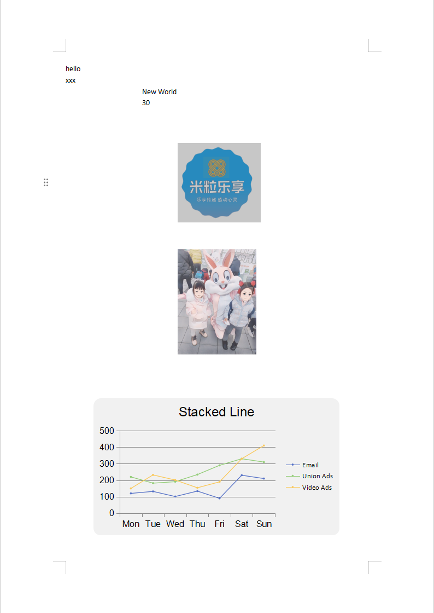
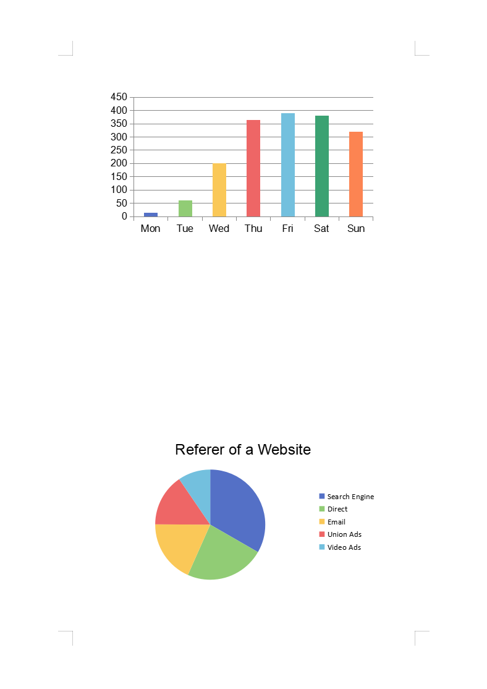
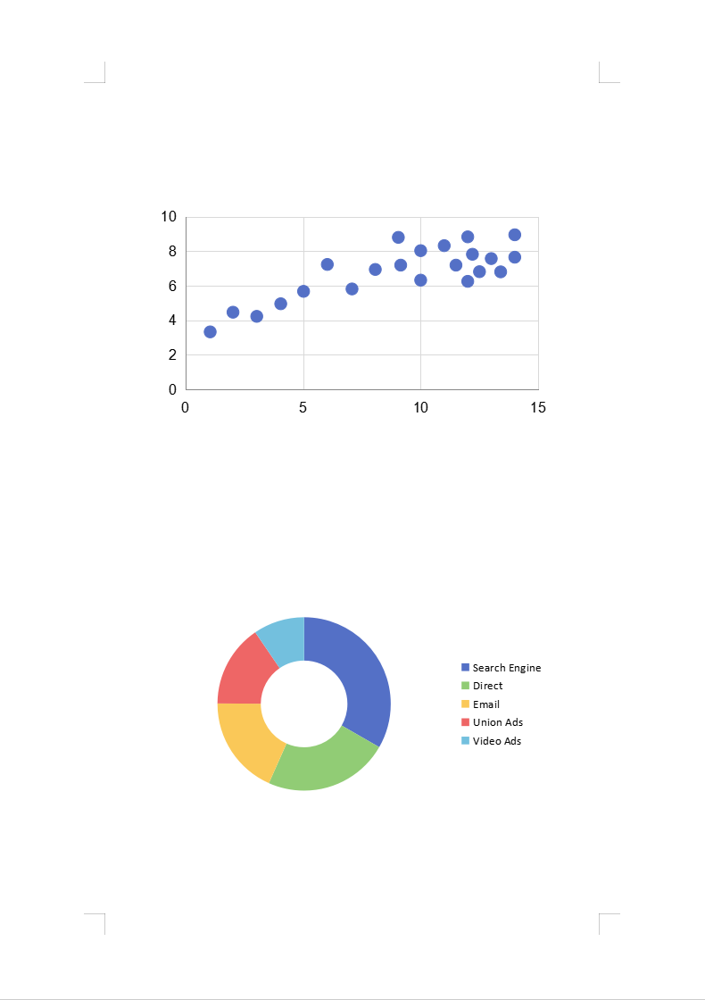

## Installation

[Puredocx NPM Home](https://www.npmjs.com/package/@mllx87/puredocx)

With modules:
~~~
npm install --save @mllx87/puredocx
npm install --save https://cdn.puredocx.com/static/js/mllx87-puredocx-pro-module-1.0.0.tgz
~~~

## Function
[puredocx-pro-module](https://puredocx.com) :
- Image function to add an image and replace an existing image with the syntax: {%image};
- Html function to insert formatted text in a docx document with the syntax {~html};
- XLSX function to be able to do templating on Excel files (xlsx extension), also with loops and conditions;
- Chart function to add a chart by using data from the JSON object that you give with the syntax {$chart};
- Watermark function to replace a given Watermark with the syntax: {watermark};
- QrCode function to add a qrcode with the syntax {&qrcode};

## Usage
First, download the [input.docx](https://github.com/mllx87/puredocx-examples/blob/master/powerpoint/simple/simple.pptx) file and place it in the same folder as your JavaScript file.

``` js
const Puredocx = require("@mllx87/puredocx");


const pure = require("@mllx87/puredocx-pro-module");


var puredocx = new Puredocx(pure, {
    "imageOptions": {
        imageRootPath: "",
        getSize() { return [350, 300] }
    }
})


// Make sure to load your metered License API key prior to using the library.
// If you need a key, you can sign up and create a free one at https://puredocx.com
puredocx.setMeteredKey("you-metered-key")

var substitutions = {
    "title": "hello",
    "summary": "New World",
    "staff": 30,
    "addr": "spead",
    "company": "xxx",
    "image": "104050.png",
    "logo": "99e36.jpeg",
    "html": "<p>Hello <b>John</b></p>",
    "code": 'https://www.baidu.com',
    "line": {
        width: 450,
        height: 250,
        backgroundColor: 'F1F1F1',
        title: {
            text: 'Stacked Line',
            textStyle: {
                color: '',
                fontFamily: "",
                fontSize: 18
            }
        },
        tooltip: {
            trigger: 'axis'
        },
        legend: {
            top: 'middle',
            left: 'right',
            orient: 'vertical',
            data: ['Email', 'Union Ads', 'Video Ads']
        },
        xAxis: {
            type: 'category',
            boundaryGap: false,
            data: ['Mon', 'Tue', 'Wed', 'Thu', 'Fri', 'Sat', 'Sun']
        },
        yAxis: {
            axisLine: {
                show: true
            },
            type: 'value'
        },
        series: [
            {
                name: 'Email',
                type: 'line',
                smooth: true,
                symbol: "circle",
                symbolSize: 9,
                lineStyle: {
                    width: 2,
                },
                data: [120, 132, 101, 134, 90, 230, 210]
            },
            {
                name: 'Union Ads',
                type: 'line',
                data: [220, 182, 191, 234, 290, 330, 310]
            },
            {
                name: 'Video Ads',
                type: 'line',
                data: [150, 232, 201, 154, 190, 330, 410]
            }
        ]
    },
    "bar": {
        width: 450,
        height: 250,
        tooltip: {
            trigger: 'axis',
            axisPointer: {
                type: 'shadow'
            }
        },
        grid: {
            left: '3%',
            right: '4%',
            bottom: '3%',
            containLabel: true
        },
        xAxis: [
            {
                type: 'category',
                data: ['Mon', 'Tue', 'Wed', 'Thu', 'Fri', 'Sat', 'Sun'],
                axisTick: {
                    alignWithLabel: true
                }
            }
        ],
        yAxis: [
            {
                type: 'value'
            }
        ],
        series: [
            {
                name: 'Direct',
                type: 'bar',
                barWidth: '60%',
                data: [10, 52, 200, 334, 390, 330, 220]
            },
            {
                name: 'Website',
                type: 'bar',
                barWidth: '60%',
                data: [15, 62, 100, 364, 330, 380, 320]
            }
        ]
    },
    "pie": {
        width: 450,
        height: 250,
        title: {
            text: 'Referer of a Website',
            subtext: 'Fake Data',
            left: 'center',
            textStyle: {
                color: '',
                fontFamily: "",
                fontSize: 18
            }
        },
        tooltip: {
            trigger: 'item'
        },
        legend: {
            orient: 'vertical',
            left: 'left'
        },
        series: [
            {
                name: 'Access From',
                type: 'pie',
                radius: '50%',
                data: [
                    { value: 1048, name: 'Search Engine' },
                    { value: 735, name: 'Direct' },
                    { value: 580, name: 'Email' },
                    { value: 484, name: 'Union Ads' },
                    { value: 300, name: 'Video Ads' }
                ],
                emphasis: {
                    itemStyle: {
                        shadowBlur: 10,
                        shadowOffsetX: 0,
                        shadowColor: 'rgba(0, 0, 0, 0.5)'
                    }
                }
            }
        ]
    },
    "scatter": {
        width: 450,
        height: 250,
        showLabel: false,
        lineSize: 0,
        xAxis: {},
        yAxis: {},
        series: [
            {
                symbolSize: 10,
                data: [
                    [10.0, 8.04],
                    [8.07, 6.95],
                    [13.0, 7.58],
                    [9.05, 8.81],
                    [11.0, 8.33],
                    [14.0, 7.66],
                    [13.4, 6.81],
                    [10.0, 6.33],
                    [14.0, 8.96],
                    [12.5, 6.82],
                    [9.15, 7.2],
                    [11.5, 7.2],
                    [3.03, 4.23],
                    [12.2, 7.83],
                    [2.02, 4.47],
                    [1.05, 3.33],
                    [4.05, 4.96],
                    [6.03, 7.24],
                    [12.0, 6.26],
                    [12.0, 8.84],
                    [7.08, 5.82],
                    [5.02, 5.68]
                ],
                type: 'scatter'
            }
        ]
    },
    "bubble": {
        width: 900,
        height: 500,
        showLabel: false,
        lineSize: 0,
        xAxis: {},
        yAxis: {},
        series: [
            {
                symbolSize: function (data) {
                    return Math.sqrt(data[2]) / 5e2;
                },
                name: '1990',
                data: [
                    [28604, 77, 17096869, 'Australia', 1990],
                    [31163, 77.4, 27662440, 'Canada', 1990],
                    [1516, 68, 1154605773, 'China', 1990],
                    [13670, 74.7, 10582082, 'Cuba', 1990],
                    [28599, 75, 4986705, 'Finland', 1990],
                    [29476, 77.1, 56943299, 'France', 1990],
                    [31476, 75.4, 78958237, 'Germany', 1990],
                    [28666, 78.1, 254830, 'Iceland', 1990],
                    [1777, 57.7, 870601776, 'India', 1990],
                    [29550, 79.1, 122249285, 'Japan', 1990],
                    [2076, 67.9, 20194354, 'North Korea', 1990],
                    [12087, 72, 42972254, 'South Korea', 1990],
                    [24021, 75.4, 3397534, 'New Zealand', 1990],
                    [43296, 76.8, 4240375, 'Norway', 1990],
                    [10088, 70.8, 38195258, 'Poland', 1990],
                    [19349, 69.6, 147568552, 'Russia', 1990],
                    [10670, 67.3, 53994605, 'Turkey', 1990],
                    [26424, 75.7, 57110117, 'United Kingdom', 1990],
                    [37062, 75.4, 252847810, 'United States', 1990]
                ],
                type: 'scatter'
            }, {
                symbolSize: function (data) {
                    return Math.sqrt(data[2]) / 5e2;
                },
                name: '2015',
                data: [
                    [44056, 81.8, 23968973, 'Australia', 2015],
                    [43294, 81.7, 35939927, 'Canada', 2015],
                    [13334, 76.9, 1376048943, 'China', 2015],
                    [21291, 78.5, 11389562, 'Cuba', 2015],
                    [38923, 80.8, 5503457, 'Finland', 2015],
                    [37599, 81.9, 64395345, 'France', 2015],
                    [44053, 81.1, 80688545, 'Germany', 2015],
                    [42182, 82.8, 329425, 'Iceland', 2015],
                    [5903, 66.8, 1311050527, 'India', 2015],
                    [36162, 83.5, 126573481, 'Japan', 2015],
                    [1390, 71.4, 25155317, 'North Korea', 2015],
                    [34644, 80.7, 50293439, 'South Korea', 2015],
                    [34186, 80.6, 4528526, 'New Zealand', 2015],
                    [64304, 81.6, 5210967, 'Norway', 2015],
                    [24787, 77.3, 38611794, 'Poland', 2015],
                    [23038, 73.13, 143456918, 'Russia', 2015],
                    [19360, 76.5, 78665830, 'Turkey', 2015],
                    [38225, 81.4, 64715810, 'United Kingdom', 2015],
                    [53354, 79.1, 321773631, 'United States', 2015]
                ],
                type: 'scatter'
            }
        ]
    },
    "doughnut": {
        width: 450,
        height: 250,
        tooltip: {
            trigger: 'item'
        },
        legend: {
            top: '5%',
            left: 'center'
        },
        series: [
            {
                name: 'Access From',
                type: 'pie',
                radius: ['40%', '70%'],
                avoidLabelOverlap: false,
                label: {
                    show: false,
                    position: 'center'
                },
                emphasis: {
                    label: {
                        show: true,
                        fontSize: 40,
                        fontWeight: 'bold'
                    }
                },
                labelLine: {
                    show: false
                },
                data: [
                    { value: 1048, name: 'Search Engine' },
                    { value: 735, name: 'Direct' },
                    { value: 580, name: 'Email' },
                    { value: 484, name: 'Union Ads' },
                    { value: 300, name: 'Video Ads' }
                ]
            }
        ]
    },
    "radar": {
        title: {
            text: 'Basic Radar Chart',
            textStyle: {
                color: '',
                fontFamily: "",
                fontSize: 18
            }
        },
        legend: {
            data: ['Allocated Budget', 'Actual Spending']
        },
        radar: {
            // shape: 'circle',
            indicator: [
                { name: 'Sales', max: 6500 },
                { name: 'Administration', max: 16000 },
                { name: 'Information Technology', max: 30000 },
                { name: 'Customer Support', max: 38000 },
                { name: 'Development', max: 52000 },
                { name: 'Marketing', max: 25000 }
            ]
        },
        series: [
            {
                name: 'Budget vs spending',
                type: 'radar',
                data: [
                    {
                        value: [4200, 3000, 20000, 35000, 50000, 18000],
                        name: 'Allocated Budget'
                    },
                    {
                        value: [5000, 14000, 28000, 26000, 42000, 21000],
                        name: 'Actual Spending'
                    }
                ]
            }
        ]
    },
    "area": {
        xAxis: {
            type: 'category',
            boundaryGap: false,
            data: ['Mon', 'Tue', 'Wed', 'Thu', 'Fri', 'Sat', 'Sun']
        },
        yAxis: {
            type: 'value'
        },
        series: [
            {
                data: [820, 932, 901, 934, 1290, 1330, 1320],
                type: 'line',
                areaStyle: {}
            }
        ]
    }

};


puredocx.renderAsync("input.docx", substitutions, "output.docx")

```

output:




For more options see:[PureDocx](https://puredocx.com)